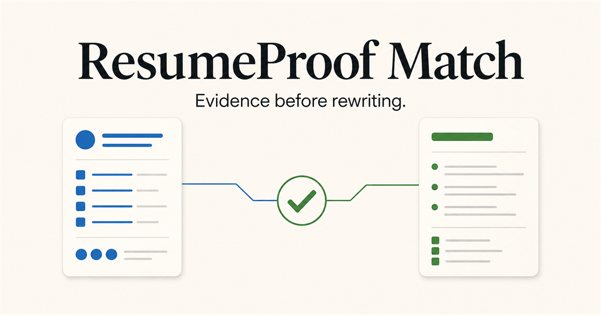

# ResumeProof Match

一个“证据优先”的简历与 JD 匹配工具。它不只给一个模糊分数，而是把岗位要求与简历原句逐条对照，说明差距，并让用户审核每一处改写后再导出。

[体验在线网站](https://resumeproof.szw19990924.chatgpt.site/?utm_source=github&utm_medium=referral&utm_campaign=website_repo_202609) · [English](README.md) · [配套 AI Agent Skill](https://github.com/caihhhhhh/resume-proof-match)



## 能做什么

- 读取 PDF、DOCX、TXT、Markdown、PNG、JPG 和 WebP 格式的简历与 JD。
- 尝试解析职位链接；页面无法稳定读取时，明确请用户粘贴并审核原文。
- 使用语义分析，而不是只做关键词命中。
- 分开判断“岗位适配”“证据覆盖”和“简历表达”。
- 为匹配结论引用可核对的简历原句。
- 给出改写建议及原因，用户可以采用、拒绝或继续编辑。
- 提供结构化全文编辑、3 种版式，以及 HTML、PDF 和 DOCX 导出。
- 支持可选 OCR、中英文界面、隐私控制、GA4 漏斗分析和私有管理后台。

## 使用流程

```text
简历 + JD
    ↓ 审核识别文字
基于证据的匹配报告
    ↓ 采用、拒绝或修改建议
全文审核
    ↓ 选择版式
HTML / PDF / DOCX
```

## 本地运行

需要 Node.js 22.13 或更高版本。

```bash
npm ci
cp .env.example .env.local
npm run dev
```

打开 `http://localhost:3000`。AI 分析和 OCR 需要在服务端配置密钥；不配置密钥也可以查看界面与示例流程。

环境变量说明见 [`.env.example`](.env.example)。不要提交 `.env.local`、API Key、服务账号 JSON 或真实简历。

## 本地验收

```bash
npm run lint
npm run build
```

## 隐私与边界

文件会尽可能先在浏览器中读取。用户主动开始分析后，简历与 JD 文字才会发送到已配置的 AI 服务；扫描文档可能发送到视觉识别服务。AI 结果只是辅助建议，必须由用户审核。详见在线[隐私说明](https://resumeproof.szw19990924.chatgpt.site/privacy?utm_source=github&utm_medium=referral&utm_campaign=website_repo_202609)。

请不要在 Issue 中上传简历、申请记录、API Key 或其他个人信息。安全报告方式见 [SECURITY.md](SECURITY.md)。

## 文档

- [GA4 后台配置](docs/ga4-admin-setup.zh-CN.md)
- [UTM 渠道管理手册](docs/utm-channel-playbook.zh-CN.md)

## 开源许可

[MIT](LICENSE)
